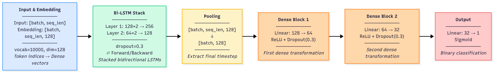

# Spam Detection System - COS30049

A comprehensive machine learning pipeline for spam detection using multiple algorithms including K-Means clustering, XGBoost classification, and BiLSTM deep learning models.

## Table of Contents

- [Project Overview](#project-overview)
- [File Structure](#file-structure)
- [Environment Setup](#environment-setup)
- [Dataset Information](#dataset-information)
- [Model Training Instructions](#model-training-instructions)
- [Prediction Guide](#prediction-guide)
- [Model Performance](#model-performance)
- [Project Architecture](#project-architecture)

## Project Overview

This project implements a multi-modal spam detection system that combines traditional machine learning approaches with deep learning techniques. The system processes messages from various sources (SMS, email, YouTube comments, reviews) and applies three different modeling approaches:

1. **K-Means Clustering**: Unsupervised approach for pattern discovery
2. **XGBoost**: Gradient boosting classifier with feature importance analysis
3. **BiLSTM**: Bidirectional LSTM with attention mechanism for contextual understanding

## File Structure

```
Spam-Detection-COS30049/
├── combined_notebook.ipynb          # Main execution notebook
├── requirements.txt                 # Python dependencies
│
├── datasets/                       # Data storage
│   ├── combined.csv                # Merged dataset from all sources
│   ├── sms/                        # SMS dataset
│   ├── email/                      # Email dataset
│   ├── mix_email_sms/              # Mixed SMS/email dataset
│   └── comment/                    # YouTube comments dataset
│
├── final_dataset/                  # Cleaned and split datasets
│   ├── train.csv                   # Training data (85%)
│   └── test.csv                    # Testing data (15%)
│
├── src/                            # Source code modules
│   ├── base_preprocessing/         # Data combination and cleaning
│   │   ├── combine.py              # Dataset merging functions
│   │   ├── clean.py                # Text preprocessing pipeline
│   │   └── correlation_analysis.py # Feature correlation analysis
│   │
│   ├── kmeans/                     # K-Means clustering implementation
│   │   ├── feature_engineer.py    # TF-IDF feature engineering
│   │   ├── train.py                # Clustering model training
│   │   ├── model.py                # Inference class
│   │   ├── compare_k_values.py     # K-value optimization
│   │   └── run_models.py           # Batch model execution
│   │
│   ├── xgb/                        # XGBoost classification
│   │   ├── feature_engineer.py    # ML feature engineering
│   │   ├── train.py                # Hyperparameter tuning & training
│   │   ├── model.py                # Classification inference
│   │   └── evaluation.py          # Performance evaluation
│   │
│   └── lstm/                       # BiLSTM deep learning
│       ├── preprocessing.py       # Text tokenization & padding
│       ├── train.py                # Neural network training
│       ├── model.py                # Deep learning inference
│       └── evaluation.py          # Model assessment
│
├── models/                         # Trained model artifacts
│   ├── kmeans/                     # Clustering models by K-value
│   │   └── k3/tfidf_1000/         # Best K-Means configuration
│   ├── xgboost/                    # XGBoost trained models
│   └── lstm/                       # BiLSTM model variants
│       └── deep_bilstm_chosen/     # Best performing LSTM
│
├── preprocessed/                   # Feature engineering outputs
│   ├── kmeans/                     # TF-IDF features for clustering
│   ├── xgboost/                    # ML features for classification
│   └── lstm/                       # Tokenized sequences for deep learning
│
└── correlation_results/            # Feature analysis results
    ├── correlations_sorted.csv     # Feature correlation matrix
    ├── engineered_features_correlation_report.txt
    └── engineered_features_summary.json
```

## Environment Setup

### Prerequisites

- Python 3.10 or higher
- Conda package manager
- CUDA-compatible GPU (optional, for faster training)

### Step-by-Step Environment Configuration

1. **Clone the Repository**
   ```bash
   git clone https://github.com/minhan6559/Spam-Detection-COS30049.git
   cd Spam-Detection-COS30049
   ```

2. **Create Conda Environment**
   ```bash
   conda create --name spam-detection python=3.11
   conda activate spam-detection
   ```

3. **Install GPU Support**
   ```bash
   # Install PyTorch with CUDA support (if GPU available)
   pip3 install torch torchvision --index-url https://download.pytorch.org/whl/cu126

   # Or install CPU-only version
   pip3 install torch torchvision
   ```

4. **Install Additional Requirements**
   ```bash
   pip install -r requirements.txt
   ```

5. **Download NLTK Data**
   ```python
   import nltk
   nltk.download('punkt')
   nltk.download('stopwords')
   ```

6. **Verify GPU Installation**
   ```bash
   python -c "import torch; print('CUDA available:', torch.cuda.is_available())"
   python -c "import xgboost; import sklearn; import pandas; print('All packages installed successfully')"
   ```

### Required Dependencies

The `requirements.txt` includes these key packages:
- **pandas**: Data manipulation and analysis
- **numpy**: Numerical computing
- **scikit-learn==1.7.2**: Machine learning algorithms
- **xgboost==3.0.5**: Gradient boosting framework
- **torch**: PyTorch deep learning framework
- **nltk**: Natural language processing
- **matplotlib**: Data visualization
- **seaborn**: Statistical data visualization
- **joblib==1.5.2**: Model persistence

## Dataset Information

### Data Sources

The project uses five distinct message datasets:

1. **SMS Dataset** (`datasets/sms/sms.csv`): Traditional SMS spam/ham messages
2. **Email Dataset** (`datasets/email/email.csv`): Email spam classification data
3. **Mixed Dataset** (`datasets/mix_email_sms/mix.csv`): Combined SMS and email messages
4. **YouTube Comments** (`datasets/comment/youtube_comments.csv`): Comment spam detection

Final dataset with preprocessed train and test set will be saved into `final_dataset` folder.

### Data Preprocessing

The preprocessing pipeline (`src/base_preprocessing/clean.py`) performs:

- **Text Normalization**: Converts to lowercase, removes extra whitespace
- **Token Replacement**: URLs → `<URL>`, emails → `<EMAIL>`, phone numbers → `<PHONE>`
- **Label Standardization**: Converts all labels to binary spam (1) / ham (0)
- **Data Balancing**: Adjusts spam ratios across different sources
- **Train/Test Split**: 85% training, 15% testing with stratification

### Target Spam Rates

```python
target_spam_rates = {
    "sms": 0.3,           # 30% spam rate for SMS
    "email": 0.35,        # 35% spam rate for email
    "mix_email_sms": None, # Keep original distribution
    "youtube": None,      # Keep original distribution
}
```

## Model Training Instructions

### Complete Pipeline Execution

The easiest way to train all models is through the main notebook:

```bash
jupyter notebook combined_notebook.ipynb
```

Execute all cells sequentially to run the complete pipeline.

### Individual Model Training

#### 1. Data Preparation (Required for all models)

```python
from src.base_preprocessing.combine import combine_datasets
from src.base_preprocessing.clean import run_base_preprocessing_pipeline

# Combine datasets
file_paths = {
    "sms": "datasets/sms/sms.csv",
    "email": "datasets/email/email.csv",
    "mix": "datasets/mix_email_sms/mix.csv",
    "youtube": "datasets/comment/youtube_comments.csv"
}

combine_datasets(file_paths, output_path="datasets/combined.csv")

# Clean and preprocess
success = run_base_preprocessing_pipeline(
    target_spam_rates=target_spam_rates,
    input_path="datasets/combined.csv",
    test_size=0.15,
    soft_cap_ratio=0.35,
    output_dir="final_dataset"
)
```

#### 2. XGBoost Training (Recommended Approach)

```python
from src.xgb.feature_engineer import engineer_ml_features
from src.xgb.train import train_xgboost_model

# Feature Engineering
output_dir, metadata = engineer_ml_features(
    data_path="final_dataset",
    output_dir="preprocessed/xgboost",
    max_tfidf_features=10000,
    ngram_range=(1, 2)
)

# Model Training with Hyperparameter Search
model, results = train_xgboost_model(
    features_dir="xgboost",
    output_dir="models/xgboost",
    cv_folds=5,
    n_iter=500,  # Number of random parameter combinations
    random_state=36,
    verbose=1
)
```

**Training Parameters:**
- Cross-validation: 5-fold stratified
- Hyperparameter search: 500 random combinations
- Optimization metric: Area Under Precision-Recall Curve (AUCPR)
- Early stopping: Prevents overfitting
- Threshold optimization: F1-score maximization

**Note**: To modify the hyperparameter search space, edit the `define_xgb_param_distributions()` function in `src/xgb/train.py`

#### 3. K-Means Clustering

```python
from src.kmeans.feature_engineer import engineer_features
from src.kmeans.train import train_kmeans

# Feature Engineering for Clustering
features_path, metadata = engineer_features(
    data_path="final_dataset",
    output_dir="preprocessed/kmeans/tfidf_1000",
    max_tfidf_features=1000,
    source_weight=0.0
)

# Clustering Training
model, results = train_kmeans(
    features_dir="preprocessed/kmeans/tfidf_1000",
    output_dir="models/kmeans/k3/tfidf_1000",
    k_clusters=3
)
```

**Clustering Configuration:**
- TF-IDF features: 1000 maximum features
- K-value: 3 clusters (optimal based on silhouette analysis)
- Evaluation metrics: Silhouette score, Adjusted Rand Index, Normalized Mutual Information

#### 4. BiLSTM Deep Learning

After experimenting with multiple LSTM configurations including unidirectional LSTM, basic BiLSTM, and BiLSTM with attention mechanisms, we found that the deep BiLSTM architecture achieves the best performance. The model combines bidirectional processing with multiple hidden layers to capture complex sequential patterns in text data.



```python
from src.lstm.preprocessing import run_lstm_preprocessing
from src.lstm.train import run_lstm_experiments

# Text Preprocessing for LSTM
run_lstm_preprocessing(
    input_dir="final_dataset",
    output_dir="preprocessed/lstm",
    vocab_size=10000,
    max_length=None,  # Auto-determined (capped at 128)
    min_freq=2
)

# Model Configuration
model_configs = [
    {
        "name": "deep_bilstm_chosen",
        "config": {
            "embedding_dim": 128,
            "hidden_dims": [128, 64],  # Two LSTM layers
            "dense_layers": [64, 32],   # Two dense layers
            "dropout_rate": 0.3,
            "bidirectional": True,
            "use_attention": False,
        },
    }
]
```

```python
train_config = {
    "epochs": 500,
    "batch_size": 512,
    "learning_rate": 0.0001,
    "weight_decay": 1e-5,
    "early_stopping_patience": 10,
    "lr_patience": 3,
    "lr_factor": 0.5,
    "clip_grad_norm": 1.0,
}

# Training
results = run_lstm_experiments(
    model_configs,
    train_config,
    data_dir="preprocessed/lstm",
    output_dir="models/lstm",
    device="cuda" if torch.cuda.is_available() else "cpu"
)
```

**LSTM Training Features:**
- Early stopping with patience monitoring
- Learning rate scheduling
- Gradient clipping for stability
- GPU acceleration (when available)
- Validation loss monitoring

### Training Time Estimates

- **XGBoost**: 10-30 minutes (depending on hyperparameter search iterations)
- **K-Means**: 2-5 minutes per configuration
- **BiLSTM**: 30-60 minutes (varies by GPU availability and model complexity)

## Prediction Guide

### Loading Trained Models

```python
from src.xgb.model import XGBTextClassifier
from src.kmeans.model import KMeansTextInferencer
from src.lstm.model import LSTMTextClassifier

# Load models
xgb_model = XGBTextClassifier(model_dir="models/xgboost")
kmeans_model = KMeansTextInferencer(model_dir="models/kmeans/k3/tfidf_1000")
lstm_model = LSTMTextClassifier(model_dir="models/lstm/deep_bilstm_chosen")
```

### Making Predictions

```python
# Sample input texts
input_texts = [
    "Congratulations! You've won a $1000 gift card! Click here to claim now!",
    "Hey, are we still meeting for lunch tomorrow?",
    "URGENT: Your account will be suspended. Verify now at suspicious-link.com",
    "Thanks for the presentation slides. Very helpful!"
]

# XGBoost Predictions (Recommended)
xgb_labels = xgb_model.predict(input_texts)
xgb_proba = xgb_model.predict_proba(input_texts)
print("XGBoost Predictions:")
for text, label, prob in zip(input_texts, xgb_labels, xgb_proba):
    print(f"  {'SPAM' if label == 1 else 'HAM'} ({prob*100:.1f}%): {text[:50]}...")

# K-Means Predictions (labels only)
kmeans_labels = kmeans_model.predict(input_texts)
print("\nK-Means Predictions:")
for text, label in zip(input_texts, kmeans_labels):
    print(f"  {'SPAM' if label == 1 else 'HAM'}: {text[:50]}...")

# BiLSTM Predictions
lstm_labels = lstm_model.predict(input_texts)
lstm_proba = lstm_model.predict_proba(input_texts)
print("\nBiLSTM Predictions:")
for text, label, prob in zip(input_texts, lstm_labels, lstm_proba):
    print(f"  {'SPAM' if label == 1 else 'HAM'} ({prob*100:.1f}%): {text[:50]}...")
```

### Prediction Output Format

- **predict(texts)**: returns a NumPy array of integers with shape (n_samples,), where each value is 0 (ham) or 1 (spam).
- **predict_proba(texts)**: returns a NumPy array of floats with shape (n_samples,), where each value is in [0.0, 1.0] representing spam probability.

```python
labels = model.predict(texts)        # e.g., array([1, 0, 1, ...])
proba = model.predict_proba(texts)   # e.g., array([0.93, 0.12, 0.76, ...])
```

### Batch Prediction

For large-scale prediction tasks:

```python
import pandas as pd

# Load test data
test_data = pd.read_csv("your_messages.csv")
messages = test_data['text'].tolist()

labels = xgb_model.predict(messages)
proba = xgb_model.predict_proba(messages)

# Save results
results_df = pd.DataFrame({
    'message': messages,
    'prediction': labels,
    'confidence': proba
})
results_df.to_csv("spam_predictions.csv", index=False)
```

## Model Performance

### Performance Comparison Table

| Model | Accuracy | Precision | Recall | F1-Score | ROC-AUC |
|-------|----------|-----------|--------|----------|---------|
| **K-Means** | 83.5% | **99.6%** | 51.4% | 67.8% | 0.782 |
| **XGBoost** | 91.8% | 86.6% | 89.6% | 88.1% | 0.965 |
| **BiLSTM** | **97.1%** | 94.7% | **96.8%** | **95.7%** | **0.994** |

### Model Analysis

#### BiLSTM
- **Strengths**: Highest accuracy (97.1%), recall (96.8%), F1-score (95.7%), and ROC-AUC (0.994)
- **Use Case**: Production systems requiring maximum accuracy and recall
- **Trade-offs**: Higher computational cost, longer training time

#### XGBoost
- **Strengths**: Excellent balance of precision (86.6%) and recall (89.6%), fast inference
- **Use Case**: Real-time applications, feature analysis, model interpretability
- **Trade-offs**: Good general performance across all metrics

#### K-Means
- **Strengths**: Exceptional precision (99.6%), unsupervised learning capability
- **Use Case**: Data exploration, high-precision requirements, anomaly detection
- **Trade-offs**: Lower recall (51.4%), requires post-processing for classification

## Project Architecture

### Design Principles

1. **Modular Design**: Each algorithm in separate modules for maintainability
2. **Consistent Interfaces**: Unified prediction API across all models
3. **Reproducible Results**: Fixed random seeds and versioned dependencies
4. **Scalable Processing**: Efficient feature engineering and batch prediction
5. **Comprehensive Evaluation**: Multiple metrics and cross-source validation

### Extensibility

The modular architecture supports:
- Adding new datasets (implement in `src/base_preprocessing/combine.py`)
- New algorithms (follow existing model patterns in `src/`)
- Custom feature engineering (extend feature engineering modules)
- Different evaluation metrics (modify evaluation scripts)